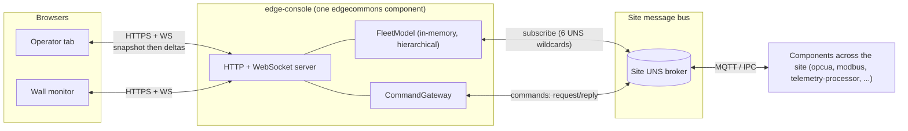
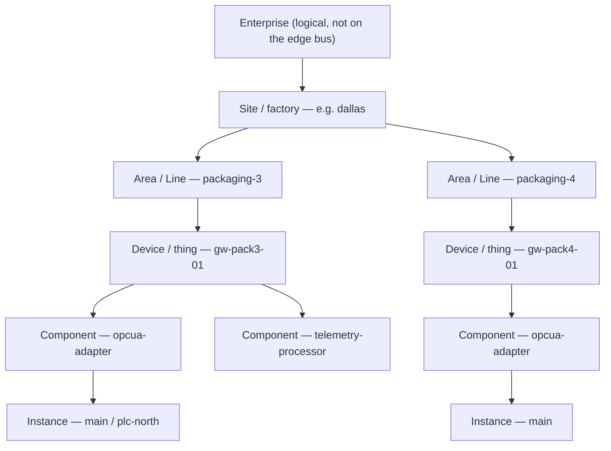
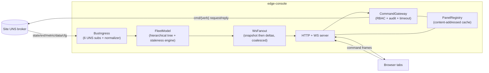
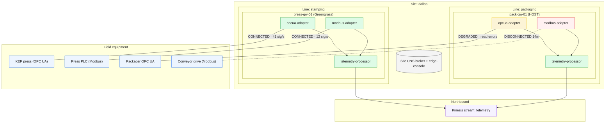

# EdgeCommons Edge Console — Design

**Version 0.3** · Status: **DESIGN (low-fidelity)** · 2026-07-02

> This is a design document, not an implementation. It is deliberately opinionated: because EdgeCommons has
> **no production installed base yet**, this revision treats the core `edgecommons` libraries as **in scope to change**,
> and mandates the changes needed to make a single, reliable, site-wide console possible. Every mandated change is
> listed explicitly in [§12](#12-mandated-changes-the-core-lib-asks).
>
> **What changed** (per version) is in [the changelog](#appendix-a--changelog). v0.2 made the console **site-scoped**
> over a real hierarchy, on a **Unified Namespace**, reached through a small **bridge component**, with a **richer
> control model** and a **graphical topology** view. **v0.3** makes the hierarchy **enterprise-configurable** (arbitrary
> named levels), moves **identity to a top-level element** with a **device-only, depth-bounded topic**, and reframes the
> messaging model as a general-purpose **`gg.messaging()`** (arbitrary topics) + an explicit **`gg.uns()`** topic
> builder, with the platform facades as the reserved, mostly-automatic surface.
>
> **Split (2026-07-02):** the platform-level **UNS** design — namespace, message classes, configurable hierarchy +
> top-level identity, the `messaging()` / `uns()` / facade API, streaming enrichment, and the `uns-bridge` site-bus
> realization — now lives in the **edgecommons repo → `docs/platform/DESIGN-uns.md`** (indexed in
> `docs/platform/README.md`). This document covers only the **console**; **§3–§5** are console-facing summaries that
> reference it.

---

## Table of contents

1. [What the Edge Console is](#1-what-the-edge-console-is)
2. [The site model: an enterprise-configurable hierarchy](#2-the-site-model)
3. [Platform dependency — the UNS and the site bus](#3-platform-dependency--the-uns-and-the-site-bus)
4. [How the console consumes the UNS](#4-how-the-console-consumes-the-uns)
5. [The console's own component surface](#5-the-consoles-own-component-surface)
6. [Console architecture](#6-console-architecture)
7. [Cross-cutting interfaces, as UNS classes and verbs](#7-cross-cutting-interfaces)
8. [Dynamic panels and rich control](#8-dynamic-panels-and-rich-control)
9. [Screens](#9-screens)
10. [Security](#10-security)
11. [Compliance tiers: how the fleet degrades gracefully](#11-compliance-tiers)
12. [Mandated changes: the core-lib asks](#12-mandated-changes-the-core-lib-asks)
13. [Open decisions](#13-open-decisions)
14. [Risks](#14-risks)
15. [Deferred / non-goals](#15-deferred--non-goals)
- [Appendix A — Changelog](#appendix-a--changelog)

---

## 1. What the Edge Console is

The Edge Console is a **browser-based operations console for a fleet of edgecommons components at one industrial
site**. Its two priority jobs are, in order:

1. **Edge health monitoring** — is everything alive, what is wrong right now, and where.
2. **Configuration review** — retrieve and inspect each component's *effective* running configuration.

Beyond those it provides command and control (issue commands to components, including device writes through the
southbound adapters), an events/alarms feed, a data-plane signal browser, and a graphical map of the site.

It is itself a **standard edgecommons component**, so it deploys the same way as everything else across the three
platforms (HOST, Greengrass, Kubernetes) and speaks the same message bus. The important architectural fact is what
sits on either side of it:



The browser **never** talks to components directly — components are not individually reachable (on Greengrass IPC
they are not addressable off-device at all). The console is the **sole bridge** between the browser world (HTTPS +
WebSocket) and the bus world (the edgecommons message envelope over MQTT or IPC). Everything the UI shows is either a
live bus message or something the console computed from bus messages; everything the UI *does* becomes a bus
command.

Two grounded facts about today's `edgecommons` shape the whole design and recur throughout:

- **There is no MQTT "retain" and no consumer-side liveness detection in the platform.** So the console cannot ask
  the broker "what was the last value?" — it must keep that itself, and it must compute staleness itself. This is
  why the console holds an in-memory model and why every screen has explicit *loading / stale / unreachable* states:
  "no data yet" and "component dead" must never look the same.
- **Request/reply has no built-in timeout**, and a caller that walks away leaks its reply subscription (which trips
  the Greengrass shared-connection quota). So command handling has to own timeouts and cleanup. This is fixed in the
  library (DESIGN-uns §7.4), not just in the console.

---

## 2. The site model

A real deployment is **hierarchical**, and the v0.1 design's flat component list was wrong about that. A factory
has multiple production **lines**; each line has one or more **devices** (gateways/edge boxes); each device runs a
set of **components**; each component may run several **instances**. Two lines commonly run the *same* components,
so identity has to include where a thing sits, or `opcua-adapter` on line 3 collides with `opcua-adapter` on line 4.

**The exact levels are the enterprise's choice** (DESIGN-uns §5). This document uses `site → area(line) → device` as
its running example, but `site → factory → zone → device` — or any other named, arbitrary-depth hierarchy — is equally
valid. What is fixed is only that one level is the physical **device** and that `component` / `instance` are the
edgecommons addressing suffix beneath it. The console renders whatever levels the deployment declares.

The console adopts that one hierarchy end to end — for identity, for grouping, and for navigation (the *topic* stays
hierarchy-independent — DESIGN-uns §3):



- **Enterprise** is deliberately *not* on the edge bus. An edge broker serves one site; multi-site rollup happens in
  the cloud, above the edge. The console is a **site** tool.
- **The hierarchy levels** (here Site, Area) are new, operator-supplied identity from a configurable schema (DESIGN-uns §5).
- **Device** is today's ThingName, resolved by the existing chain.
- **Component / Instance** already exist.

One console is scoped to one **site**. The FleetModel is a **generic tree over the configured hierarchy** (here
`Site → Area → Device`) down to `Component → Instance`; health rolls **up** the tree (a line's health is the worst of
its devices, gated by reachability), and the UI navigates *down* it: the Overview groups by the chosen level, the side
nav lists the top grouping, the breadcrumb follows `identity.path`, and routes are UNS-shaped
(`/site/{area}/{device}/{component}`).

This directly answers the "why is everything flat?" feedback: it is not flat anymore, and the hierarchy is the same
spine the namespace and the topology use.

---

## 3. Platform dependency — the UNS and the site bus

The console is a normal edgecommons component. Everything about *how it talks to other components* — the
topic namespace, message classes, configurable hierarchy, top-level identity, the `messaging()` / `uns()`
API and platform facades, streaming enrichment, and the physical **site-wide UNS bus** (the `uns-bridge` +
site broker that aggregate per-device buses) — is specified once, platform-side, in the **edgecommons repo →
`docs/platform/DESIGN-uns.md`**. This document does not re-specify it; it describes only what is
*console-specific*.

What the console adds on top of the UNS:

- **It connects to exactly one bus — the site aggregation point** (the site UNS broker; on Kubernetes, the
  in-cluster broker). The `uns-bridge` (DESIGN-uns §9) makes every device's traffic appear there, so the
  console needs a single `MessagingClient`.
- **It is single-replica.** The FleetModel is an in-memory, per-socket-consistent cache with one sequence
  space; a WebSocket pins to a server; commands are audit-ordered per server. Scale out with *more
  aggregation points* (per-line consoles), never replicas of one.
- **Browser reachability is the console's own concern** (not the bus): a local port on HOST/Greengrass; a
  Service + Ingress on Kubernetes (M13). The single-replica + long-lived-WebSocket constraint is
  documented, not a TODO.
- **Reachability is a first-class UI state.** When the `uns-bridge` Last-Will fires (DESIGN-uns §9.3), the
  console renders the device as **UNREACHABLE** — distinct from a component being OFFLINE — freezes its
  last-known children, and applies **alarm containment** (one device-unreachable alarm, `+N` suppressed),
  so one dead line is one alert, not a wall of red.

---

## 4. How the console consumes the UNS

The console needs **zero per-component knowledge** because the UNS is uniform (DESIGN-uns §3–§6):

- **Subscriptions** — the six class wildcards `ecv1/+/+/+/{state|cfg|evt|metric|data|log}` (DESIGN-uns §4).
  `data` is scoped by device in production. The console never subscribes `cmd` (it *publishes* commands) or
  `app`.
- **Identity & grouping** — the console reads the **top-level `identity`** block (never the topic) and
  builds a **generic N-level tree** from `identity.hier` (DESIGN-uns §5): group-by any configured level, no
  hardcoded "line." `identity.path` is the FleetModel key and the breadcrumb.
- **Commands** — browser actions become `cmd/{verb}` request/reply via the CommandGateway (§6.5), over the
  hardened `request()` (DESIGN-uns §7.4). The verb vocabulary (`describe`, `get-configuration`,
  `reload-config`, `sb/*`, …) is the UNS command catalog (DESIGN-uns §7.3).
- **Config / events / metrics / logs / panels / streams** — consumed from the matching UNS classes and
  verbs; stream *health* (backlog/errors) is observed via `status`/`metric`, not the stream data itself.

---

## 5. The console's own component surface

Beyond consuming the UNS, the console is the one component that also serves **browsers**. Its additions,
all console-specific:

- An **HTTPS + WebSocket server** (default `:8443`) — the sole bus↔browser bridge — configured by a new
  `console` config section (`enabled/port/bindAddress/tls/auth`), modeled on the existing `health` section
  (M12). Everything else uses the standard edgecommons surface (`gg.messaging()` / `gg.uns()` / the platform
  facades) per DESIGN-uns §7.
- The internal subsystems that turn bus traffic into a live browser experience — **FleetModel**,
  **WsFanout**, **CommandGateway**, **PanelRegistry** — are the subject of §6.

> **Cross-reference note.** Sections below occasionally cite `§4.x`/`§5.x`; unless they clearly refer to the
> console stubs above, those are the pre-split UNS sections now authoritative in **DESIGN-uns** (namespace/
> identity → DESIGN-uns §3–§6; messaging/facades → DESIGN-uns §7; streaming → DESIGN-uns §8).

---

## 6. Console architecture

Internally the console is five cooperating parts. The important design pressure everywhere is that the bus has no
retained state and no miss-detection, so the console is where "current fleet state" is *materialized*.



### 6.1 BusIngress and the FleetModel

BusIngress holds one `MessagingClient`, subscribes the six UNS wildcards, and reads identity from the top-level `identity` block
(the legacy topic-scheme parser survives only as a fallback for un-bridged/pre-UNS traffic, mapped through the
console's site-map). The **FleetModel** is the hierarchical tree from §2, keyed by UNS path, holding per node: last
`state`, derived health, ring-buffered heartbeat vitals and metrics (~15 min), **the latest value of each signal
(from `data`)**, the latest redacted `cfg`, the capability manifest from `describe`, and active alarms. **Every cached
value carries the timestamp of its last update**, so the FleetModel *is* the console's "retained value" store: a
late-joining browser gets the current value immediately **and** can see how old it is — per-value staleness (an age
badge, greyed past threshold), not just per-component liveness. This application-layer cache is what replaces broker
retain (§6.4); unlike broker retain it can *tell the user a value is stale*, and it works identically on IPC.

### 6.2 Miss-detection lives here (the platform's first)

No component reports "I am late." The FleetModel computes it. Each `state` message carries its own
`keepalive_secs` in-band, so the console needs no configuration to know a component's expected cadence: **stale at
2.5×, offline at 5×** (tunable), with a `boot_id`/`seq` pair distinguishing a restart from a gap. A 1-second sweeper
drives one reconciled state machine (HEALTHY → warn shading → STALE → OFFLINE, plus DEGRADED from `state.checks`
and UNREACHABLE from bridge Last-Wills). Every transition is itself an event feeding the WS, the alarm engine, and a
bounded event ring for reconnect replay.

### 6.3 WsFanout — snapshot then deltas

A browser tab declares a **scope** (`fleet`, a `subtree:{unsPath}` for one line/device, `component:{…}`, or
`events`). The rules: subscribe → get a **snapshot** frame with a sequence number, then monotonic **deltas** (no
client ever assembles state from deltas alone); gauge-like data is latest-wins-coalesced and flushed at ≤4 Hz per
socket; transitions and events are never coalesced; a slow tab back-pressures only itself (bounded per-socket queue,
drop coalescible first, force a resync if a transition would be dropped). Reconnect replays from the event ring or
forces a fresh snapshot.

### 6.4 Late-join without retain

This is the mechanism that makes a freshly (re)started console converge in ~2 seconds on **both** transports:

```mermaid
sequenceDiagram
  participant Con as edge-console
  participant SB as Site broker
  participant C1 as component A
  participant C2 as component B
  Con->>SB: subscribe the six UNS patterns
  Con->>SB: publish ecv1/bcast/cmd/republish-state and republish-cfg
  SB->>C1: deliver broadcast
  SB->>C2: deliver broadcast
  Note over C1,C2: each waits a random 0 to 2s to avoid a stampede
  C1-->>Con: state and cfg
  C2-->>Con: state and cfg
  Note over Con: FleetModel hydrated; browsers snapshot from the cache
```

Three layers, in priority: (1) the periodic **keepalive** `state` is the correctness backbone on IPC *and* MQTT;
(2) a **broadcast re-announce** (`ecv1/bcast/cmd/republish-state`) gives an instant full snapshot on console start;
(3) the console's **snapshot cache is the retain substitute** — the timestamped last-known-value store of §6.1, so a
late-joining browser gets every current value immediately *and* sees its age. Only **MQTT LWT** is added to the
library (§12, M7) — an *accelerator* for whole-device UNREACHABLE on the always-MQTT bridge↔site-broker hop, never a
correctness dependency, so Greengrass/IPC behaves identically minus latency. **Broker retain is deferred**: it is
MQTT-only (so it can never be the mechanism IPC relies on), redundant with (3), and — unlike the application-layer
cache — cannot express staleness. If it is ever wanted, its owner is the `uns-bridge` (one place to evict on
device-down), not each component's provider.

### 6.5 CommandGateway

Browser → bus. A WS command frame `{cmdId, target, verb, params}` is RBAC-checked, **audit-logged before dispatch**,
then issued through `gg.commands().invoke(...)` with a timeout (10 s default, 30 s for config ops). The result or
timeout is keyed back to `cmdId`, and every command is mirrored into the Events feed. Because the vocabulary is now
standard verbs (DESIGN-uns §7.3, §8), the gateway needs no per-component adapters — a stark simplification over v0.1's
capability-adapter registry.

```mermaid
sequenceDiagram
  participant UI as Browser
  participant CG as CommandGateway
  participant SB as Site broker
  participant Cmp as Component
  UI->>CG: command frame with cmdId, target, verb reload-config, params
  CG->>CG: RBAC check then append audit before dispatch
  CG->>SB: cmd/reload-config with reply_to and correlation_id
  SB->>Cmp: matches its cmd wildcard subscription
  Cmp->>Cmp: validate params vs schema then run handler
  Cmp-->>CG: reply ok true, correlation echoed
  CG->>CG: unsubscribe reply topic always, also on timeout
  CG-->>UI: result keyed by cmdId; mirror to Events
```

---

## 7. Cross-cutting interfaces

The v0.1 "interface catalog" was right about *what* the console needs; the UNS just gives each item a consistent
home. In the new model they are **classes** (things components publish) and **command verbs** (things the console
invokes):

| Capability | UNS form | Priority | What the console does with it |
|---|---|---|---|
| Liveness + resource vitals | `state` keepalive + `metric/sys` | #1 | health state machine, freshness, CPU/mem charts |
| Detailed health / sub-checks | `state.checks[]` | #1 | drill-in health list; DEGRADED rollups |
| Discovery / identity / versions | `state` + `describe` verb | #1 | fleet inventory, identity columns, capability-driven UI |
| Effective configuration | `cfg` snapshot + `get-configuration` / `reload-config` | #2 | the Configuration Review screen; config-drift by hash |
| Events / alarms | `evt/{sev}/{type}` | additive | notifications, active-alarm table, the Events screen |
| Metrics | `metric/{name}` | additive | schema-free metrics tables + charts |
| Logs (tail / level) | `log/{level}` + `set-log-level` | additive | per-component Logs tab |
| Lifecycle | `cmd/reload-config · pause · resume · restart` | additive | actionable config screen; adapter controls |
| Ping / RTT | `cmd/ping` | additive | "is it responsive," not just "is it publishing" |
| Southbound control + device I/O | `cmd/sb/status · sb/browse · sb/read · sb/write · …` | given→#1 | instance status, the address-space browser, confirmed writes (§8) |
| Panels | `describe` manifest + `cmd/get-panel-asset` | additive | the dynamic panel slot (§8) |

The important change from v0.1: none of these needs a per-component parser. A component either advertises a verb in
its `describe` manifest or it does not — unsupported capabilities are simply **absent** from the UI, never faked.

---

## 8. Dynamic panels and rich control

### 8.1 One passive tab is not enough

The review raised the right objection: OPC UA exposes live **address-space browsing** and direct **tag read/write**;
a single passive descriptor-rendered tab cannot express that. The answer is *not* "everyone writes JavaScript." It
is three moves:

1. **Multiple named views per component.** The `describe` panel manifest is already a list; we promote it to a real
   view model. A component registers several views — e.g. *Overview*, *Address Space*, *Signals*, *Diagnostics* —
   and the console renders them as Carbon sub-tabs inside that component's Panel area, with an instance switcher for
   instance-scoped views. A view's live subscriptions run only while it is on screen.
2. **Raise the declarative ceiling with two new console-owned widgets** — `treeBrowser` (a lazy tree bound to a
   paged command; every expand fires the command; selecting a node feeds sibling widgets) and `signalGrid` (an
   editable value grid where a cell edit *stages* into the confirm modal, never writes directly). These recur across
   every southbound protocol, so they belong in the console, not in each component's bundle. Crucially they are
   parameterized by **command bindings, not expressions** — the descriptor stays non-Turing (no logic), which is the
   line we hold (see decision D9).
3. **Keep the signed, sandboxed Web Component escape hatch** for genuinely bespoke interaction (a namespace-diff
   visualizer, a method-call wizard with struct arguments) — opaque-origin iframe, ed25519-signed, zero network
   egress, every bus call brokered and re-checked server-side, with a mandatory descriptor fallback.

So the tiering is: **descriptor for the structured 80–90%** (including full browse + read + write), **Web Component
for the bespoke remainder**.

### 8.2 Discovery is unchanged in spirit, simpler in mechanism

```mermaid
sequenceDiagram
  participant Con as edge-console
  participant Cmp as component
  Con->>Cmp: state seen with describe_digest, then cmd/describe
  Cmp-->>Con: manifest with verbs, schemas and panel views
  Con->>Cmp: cmd/get-panel-asset, chunked and hash-verified
  Cmp-->>Con: descriptor JSON eager, or signed WC bundle lazy
  Note over Con: verify sha256 and the WC signature BEFORE use, then cache content-addressed
  Note over Con: render descriptor via Carbon widgets or WC in a sandboxed iframe; on failure use the fallback ladder
```

Everything travels over the bus (components are never HTTP-reachable), the console verifies before it renders, and a
fleet of 40 identical adapters transfers each asset once (content-addressed). Any failure walks a **fallback ladder**
— WC → its fallback descriptor → the generic panel (heartbeat charts + observed metrics + topic tail) — so every
component has a useful page on day zero and a tab is never blank.

### 8.3 Mandated: a real southbound command family (confirmed writes)

To make rich control first-class we mandate a v2 southbound command family on the adapter contract (clean to do now,
no installed base), exposed as `cmd/sb.*` verbs:

- **`sb/browse`** (paged): `{ref, depth}` → child nodes `{ref, name, class, dataType?, writable?, subscribed?}`.
  OPC UA exposes its existing *internal* address-space browser on the bus (today that browse is in-process only);
  Modbus presents a **synthetic tree** (instance → unit → table → signals/ranges).
- **`sb/read`** — extended to accept refs returned by `browse`.
- **`sb/write` v2 — request/reply with acknowledgment and optional read-back** (`verify: true`). This closes v0.1's
  worst honesty gap: the console no longer says "write published, no acknowledgment"; it shows the verified value or
  a structured error. (The fire-and-forget write topic remains for machine-to-machine data-plane use; the console
  only ever issues confirmed writes.)
- **`sb/subscribe-preview`** (optional): temporarily stream a node's value so an operator can watch it before
  committing to subscription config (auto-expiring, capped).
- Adapter-side **`writes.allow[]`** (path/namespace/register allowlist) evaluated *in the adapter* — a defense
  independent of console RBAC, against both hostile bus publishers and console bugs.

### 8.4 Worked example: OPC UA browse + read/write a tag

All four views are **descriptor** (no Web Component needed). The *Address Space* view wires a `treeBrowser` to
`sb/browse`, a `keyValueList` (bound to the tree selection) to `sb/read`, and a `commandBar` with a **Write…** action
to `sb/write`:

```mermaid
sequenceDiagram
  participant Op as Operator
  participant Con as edge-console
  participant Adp as opcua-adapter
  Op->>Con: open the Address Space view
  Con->>Adp: sb/browse from root
  Adp-->>Con: child nodes, tree renders
  Op->>Con: select node Setpoint, writable
  Con->>Adp: sb/read Setpoint
  Adp-->>Con: value 40.0, quality GOOD
  Op->>Con: Write 42.5
  Note over Con: host-owned confirm modal, type-to-confirm, writes to a physical device
  Con->>Con: append audit with user, target, old to new value, before dispatch
  Con->>Adp: sb/write Setpoint 42.5 with verify true
  Adp-->>Con: reply ok true, verifiedValue 42.5
  Con-->>Op: success toast, verified 42.5; mirror to Events
```

Write safety is layered and independent at each step: console RBAC (operator+), a host-owned confirm modal with a
type-to-confirm floor the descriptor can raise but never lower, an append-only audit entry *before* dispatch, the
adapter's own `writes.allow[]`, the confirmed request/reply with read-back, the Events mirror, and site-broker ACLs
scoping `cmd/#` to each device subtree (§10). A global read-only kill-switch hard-blocks all writes server-side.

---

## 9. Screens

The console structure from v0.1 is largely retained (it reviewed well); the changes are **line grouping** on the
fleet views and one **new** screen. Wireframes accompany this document (`docs/wireframes-lofi.html`).

| Screen | Route | Purpose | Change since v0.1 |
|---|---|---|---|
| **Edge Health Overview** | `/` | health-first fleet-at-a-glance for the site | now **grouped by line**, with line rollups + containment; rows drill in |
| **Components (browser)** | `/components` | hierarchical finder: a Site → Line → Device → Component tree + search → detail | **new** — the explicit way to reach a specific component (see §9.2) |
| **Site Topology** | `/topology` | graphical site map: lines → devices → components, southbound + northbound edges | **new** (see §9.1) |
| **Component Detail** | `/site/{area}/{device}/{component}` | drill-down + the dynamic panel slot | panel slot is now **multi-view** (§8) |
| **Configuration Review** | `/config` | effective config, diff, redaction | unchanged in shape; backed by `cfg` + `get-configuration` |
| **Events & Alerts** | `/events` | alerts + component events + audit | alarm containment surfaces here |
| **Signals** | `/signals` | data-plane browser (`data` class) | unchanged |
| **Settings / Console Health** | `/settings` | console policy; the console's own health | adds the **site-map** editor (thing → line) |

### 9.1 The Site Topology view (new)

A vertical canvas with **field equipment at the bottom and cloud at the top**, lines as side-by-side containers of
device cards, components as chips inside device cards. **Southbound** edges (to PLCs / OPC UA servers / Modbus units,
from `state.dependencies[]`) are drawn downward; **northbound** edges (to IoT Core / streams) upward. Node fill
encodes the 5-state health palette; edge colour/style encodes dependency state (solid green connected, dashed red
disconnected, dotted neutral "declared but not yet observed"); edge weight/animation encodes throughput (respecting
`prefers-reduced-motion`); a corner badge counts active alarms (with "+N" for containment). Layout is deterministic
(layered, not force-directed — operators build spatial memory), rendered as SVG, drill-down by semantic zoom, and it
degrades honestly (Tier-0 components draw dotted field nodes from config; an unreachable device greys and freezes;
bus-down greys the whole canvas). Example:



Line 2's Modbus link is the red dashed edge, its adapter chip is red, and Line 2's rollup goes amber with one alarm —
the drive being down reads as *an edge problem, not a device problem*, a distinction a flat list cannot draw.

### 9.2 Finding a component

The **Overview** is health-first (it answers "what is wrong right now"), so it is not the place to hunt for a
specific, healthy component. That job belongs to the **Components** browser (`/components`): a searchable, hierarchical
**Site → Line → Device → Component → Instance** tree, each node carrying a health micro-state and child counts, with
status / type / platform facets. Picking a component leaf shows a summary card with an **Open detail** action; picking
a line or device node shows a roster of everything beneath it — so the tree doubles as the site inventory.

There are four paths to a component, all routing to the same Component Detail page: the Components tree, a row on the
Overview, a chip on the Site Topology, and a global **header search** (type-ahead over component / thing / signal
names) present on every screen. Because routes are UNS-shaped (`/site/{area}/{device}/{component}`), any component,
line, or device view is a directly shareable link.

---

## 10. Security

- **AuthN**: session cookie + local user store (argon2id; key in the console's own credentials vault), optional
  OIDC; WS upgrade via cookie + short-lived ticket; TLS on by default on HOST/Greengrass (self-signed first boot,
  replaceable), terminated at Ingress on Kubernetes.
- **AuthZ**: three roles enforced in the CommandGateway — **viewer** (read + redacted config + panels), **operator**
  (+ status/read/browse/trigger + allow-listed writes), **admin** (+ general writes, config push, users). Rendering
  is a courtesy; the server re-checks every command.
- **Config redaction is console-owned and applied at ingest**, over and above the library-side redaction in the
  `cfg`/`get-configuration` path: a JSON-pointer deny-list (`**/credentials/password`, `**/keyProvider/pin`, …) plus key-name
  regex; `$secret` refs render as locked markers, never resolved; there is **no un-redacted path** in the API, even
  for admins.
- **Bus-level authorization becomes enforceable** for the first time because of the topology: the site broker ACLs
  scope each `uns-bridge` to publish only under *its* device subtree and to accept `cmd/#` only for that subtree.
  Combined with the adapter-side `writes.allow[]`, this is the concrete mitigation for "any bus publisher can send a
  command" (decision D1) — the console does not *create* that exposure (any bus participant could always publish),
  but the site broker + bridge is the right place to contain it.

---

## 11. Compliance tiers

The fleet is a **migration, not a flag-flip** — the four existing components ship none of this yet. The console is
built so value grows monotonically:

- **Tier 0** — no library upgrade: a component seen only via legacy heartbeat gets a "limited visibility" card, with
  cadence *estimated*. Honest, useful, never a fiction.
- **Tier 1** — library upgrade, **zero component code**: `state`/`describe`/`cfg`/`ping`/`status`/metrics/log-level
  all light up automatically, and the whole priority-#1/#2 dashboard works. This is where the UNS + facades pay off.
- **Tier 2** — author opt-in: custom `status` checks + dependencies (the topology edges), events, pause/resume,
  custom command verbs, and panels.

---

## 12. Mandated changes (console-specific)

The **platform** mandates this console depends on — the UNS grammar, identity/hierarchy, the messaging model,
`request()` hardening, MQTT LWT (retain deferred), the `uns-bridge` + site broker, streaming enrichment, the southbound
command family, heartbeat-default parity, and the conformance vectors (**M1–M9, M11, M14, M15**) — live in the
edgecommons repo at **`docs/platform/DESIGN-uns.md` §11**, and were **all approved in the mandate walk of 2026-07-02**
(M7 revised to LWT-only; M9 accepted in full). This section lists only what is specific to the **`edge-console`**
component:

- **M10 · Panel schema v2** — the multi-view panel model (`order`, `default`, `scope`, `requiresRole`), the
  console-owned `treeBrowser` + `signalGrid` widgets, and the `$selection` binding (§8) — **P1.** (Renders the
  southbound command family, DESIGN-uns M9.)
- **M12 · `console` config section + real `bindAddress`** — config for the console's HTTPS+WS listener, modeled on the
  existing `health` section (satisfies NFR-SEC-4) — **P2.**
- **M13 · Kubernetes chart for the console** — a generic extra Service port + an Ingress template (none exists today)
  + the documented single-replica-for-WebSocket constraint — **P2.**

Everything else the console needs is a **consumer** relationship, not a new mandate: it uses the UNS classes and
verbs, the `messaging()` / `uns()` API, the facades, and the site bus exactly as any component would. The one
platform bug the console surfaced — the Java `ConfigManager.getFullConfig()` frozen-snapshot fix behind
`get-configuration` — is tracked in DESIGN-uns.

---

## 13. Open decisions

> **Platform / UNS decisions** (D4 LWT/retain, D8 multi-device topology, D10–D16 topic/identity/messaging/streaming)
> are now authoritative in the edgecommons repo at **`docs/platform/DESIGN-uns.md` §2** — retained below for continuity.
> The genuinely console-specific decisions are D3, D5, D6, D7, D9 (and D1/D2, which the console surfaced but the
> platform owns).

| # | Decision | Recommendation |
|---|---|---|
| D1 | Bus-level command authZ | Site-broker ACLs (per-device subtree) + adapter `writes.allow[]` + console RBAC/audit as v1; document broker/recipe patterns; track full bus authN/authZ as its own workstream. |
| D2 | Where Tier-1 responders land first | Template helper on the public API, promoted to a core `console` module once stable — **except** `get-configuration`, which needs core-internal live-getter access and lands in core with the Java fix. |
| D3 | Repo name | **`edge-console`** — ✅ **approved 2026-07-02.** |
| D4 | MQTT LWT/retain | ✅ **Revised 2026-07-02 → LWT only** (M7). LWT is required by the bridge (whole-device UNREACHABLE on the always-MQTT site-broker hop). **Retain deferred** — MQTT-only, redundant with broadcast `republish-state` + the console's timestamped cache (§6.1), and can't express staleness. See DESIGN-uns D9/§9.3. |
| D5 | Staleness thresholds | Warn shading at 2×, STALE at 2.5×, OFFLINE at 5× of the in-band `keepalive_secs`; tunable in Settings. |
| D6 | Console server language | **TypeScript/Node** on the edgecommons TS lib (shared `protocol` package with the React/Carbon UI); WS protocol kept as a hard contract so a Rust server could swap in later. |
| D7 | Config write path in v1 | Read-only + `reload-config`; feature-flagged whole-document push in Phase 2; per-key patching deferred to the SHARED_CONFIG design. |
| D8 | Multi-device topology | **`uns-bridge` + site broker** (M1) as primary; console multi-connection federation and per-line-console UI federation as documented fallbacks. |
| D9 | Descriptor DSL evolution | Hold the no-logic line; the `treeBrowser`/`signalGrid` widgets are the pressure-relief valve. Revisit derive primitives only against a "three concrete demands" bar. |
| D10 | Topic depth vs hierarchy | **Superseded in v0.3.** The topic is **device-only** (`ecv1/{device}/{component}/{instance}/{class}`) so depth is constant; the enterprise-configurable hierarchy lives in the top-level `identity`, not the topic. Optional single root level via `topic.includeRoot` for a multi-site broker. |
| D11 | Merge heartbeat + announce into `state` | Yes — one timer, one subscription, one staleness rule, and the keepalive doubles as the late-join answer. |
| D12 | Hierarchy shape | ✅ **v0.3: enterprise-configurable** — an ordered, named `hierarchy.levels` list (arbitrary depth) with one `deviceLevel`; `component`/`instance` are the fixed edgecommons suffix. |
| D13 | Identity placement | ✅ **v0.3: top-level `identity` element** (not `tags`), carrying ordered `hier` + precomputed `path` + `device`. `tags` kept for business context (app/org/cost); `tags.thing` removed. |
| D14 | Developer messaging | ✅ **v0.3:** keep **`gg.messaging()`** as the general bus taking **arbitrary topics** (UNS or external); explicit **`gg.uns()`** helper builds+validates UNS topics; `commands()` = the console-exposed request/reply subset. No dedicated service registry (rely on `describe` + `broadcast`). |
| D15 | Topic/verb delimiter | ✅ **v0.3: `/` throughout** (MQTT-native, wildcardable); `.` only as a literal within a single level (as the component name already is). Verbs lowercase-hyphenated; families namespaced (`cmd/sb/read`). |
| D16 | Streaming hierarchy layout | ✅ **Confirmed 2026-07-02** — now authoritative as **DESIGN-uns D11 / §8**. Columnar sinks: identity levels as first-class **columns**; business `tags` as a **map/JSON column** (+ optional promote-to-column list). Default **partition-by = `site` + `device`** (coarse enough to avoid a tiny-file explosion), configurable via `stream.partitionBy: [levels]`. Broker sinks: partition key = `device`. Header subset = `timestamp` + `name` + `version` (uuid optional). |

---

## 14. Risks

- **Adoption is a migration.** All four components ship none of this today; the console launches showing mostly
  Tier-0 cards until the UNS + facades roll out. The tiers make that honest, but the value curve depends on the
  library work landing.
- **The UNS is a hard cut.** Every topic, both adapters' publish paths, the processor's filters, the config-push
  source, and the interop harness change in one release train. This is the right call with no installed base, but it
  is a real, coordinated four-language change under the parity + coverage gates.
- **`uns-bridge` is now load-bearing.** It is one more component to build, certify, and operate on every device, and
  a bridge outage greys a whole device. Its drop counters, loop protection, and reachability signal must be solid;
  store-and-forward is deliberately out of v1 (the console is a live view, not a historian).
- **Bus-as-transport for panel bundles is mediocre** beyond tens of KB; content-addressed caching amortizes it to
  first-contact-per-version, and the descriptor-first default keeps most panels tiny.
- **Plaintext-secret exposure through config display** — redaction must be airtight (no un-redacted API path,
  redaction before the model, additive-only panel rules); one missed JSON-pointer leaks a password to every viewer.
- **Console footprint at the edge** — ring buffers, per-socket queues, panel cache, and per-frame ACL checks are
  real memory/CPU on a gateway box; the Console Health screen exists to make breaches visible, and the data-plane is
  ingest-sampled.

---

## 15. Deferred / non-goals

- Enterprise/multi-site rollup (the console is a site tool; multi-site is a cloud concern above the bridge's optional
  northbound relay).
- Bridge store-and-forward / durable history (belongs to streams + file-replicator).
- Per-key config patching (belongs to the unimplemented SHARED_CONFIG design).
- Console-per-device as the site answer, and console-as-N-broker-federator as the *primary* (both kept only as
  documented fallbacks).
- IoT Core as the site aggregation path (kept only as the optional HQ-relay).

---

## Appendix A — Changelog

> Section references in the entries below (e.g. `§4.4`, `§5.2`) point to sections **as they were before the
> 2026-07-02 split**; that UNS content now lives in the edgecommons repo at `docs/platform/DESIGN-uns.md`.

### v0.1 → v0.2

Responds to the first review round; each point maps to the change made.

| Feedback | Resolution |
|---|---|
| **Mandate core-lib changes while there's no installed base** | Reframed throughout; all mandates consolidated in [§12](#12-mandated-changes-the-core-lib-asks). |
| **1. A deployment diagram** | Added — [§3.2](#32-the-decision-aggregate-below-the-console-with-a-bridge) (plus system-context, hierarchy, internal-architecture, command, late-join, panel, and topology diagrams throughout). |
| **2 / 11. Multi-device / broker scope confusion** | [§3](#3-physical-topology) — one console per aggregation point, `uns-bridge` + site broker; grounded in the Greengrass-IPC-is-device-local finding. |
| **3. Rich control (OPC-UA read/write)** | [§8](#8-dynamic-panels-and-rich-control) — multi-view panels, `treeBrowser`/`signalGrid`, southbound command family v2 with confirmed writes. |
| **4. Graphical site depiction** | [§9.1](#91-the-site-topology-view-new) — the new Site Topology screen with southbound/northbound edges + example mermaid. |
| **5. Why is file-replicator special-cased?** | It no longer is — the UNS collapses every scheme onto six uniform subscriptions (DESIGN-uns §6, §4). |
| **6. Full UNS + enforcing core APIs** | [§4](#4-the-unified-namespace-uns) (namespace) + [§5](#5-enforcing-the-uns-new-core-library-apis) (facades that make ad-hoc topics impossible). |
| **7. Hard-to-follow prose; add mermaid** | Full rewrite into teaching prose; diagrams throughout. |
| **8. File the heartbeat parity issue** | Done — [edgecommons#33](https://github.com/edgecommons/edgecommons/issues/33). |
| **9. Site is flat; model factory→lines→devices** | [§2](#2-the-site-model) — the hierarchical site model and FleetModel. |
| **10. Render breaks on an embedded iframe** | Fixed — the v0.1 doc contained literal `<iframe>`/`<...>` text (machine-assembled) that renderers parsed as HTML; this rewrite keeps all such tokens in code spans. |

### v0.2 → v0.3

Responds to the identity + facade discussion; each row is a settled decision (see §13 D12–D15).

| Topic | Change |
|---|---|
| **Configurable hierarchy** | No longer hardcoded `site→area→device`. A deployment declares an ordered, freely-named `hierarchy.levels` list of arbitrary depth with one `deviceLevel` (§2, §4.4, §5.1). |
| **Identity placement** | Moved out of `tags` to a **top-level `identity` element** (§4.4) carrying ordered `hier`, precomputed `path`, and `device`. `tags.thing` removed (redundant); `tags` retained for business context (app / org / cost). |
| **Device-only topic** | `ecv1/{device}/{component}/{instance}/{class}` — the hierarchy no longer appears in the topic, so depth is **constant** and IoT-Core-safe regardless of hierarchy depth (§4.1). Optional `topic.includeRoot` for multi-site brokers. |
| **Messaging model** | `gg.messaging()` kept as the general bus taking **arbitrary literal topics** (UNS or external, for legacy-system integration); an explicit **`gg.uns()`** builds + validates UNS topics (charset + depth). Platform facades are the reserved, mostly-automatic surface; `commands()` is the console-exposed request/reply subset (§5.2). Enforcement narrowed to a reserved-platform-class guard + broker ACLs (§5.3). |
| **`request()` hardening** | Internal default deadline + optional `request(topic, msg, timeout)` overload guarantee completion + reply-topic cleanup even if the caller never waits; `reply()` / `subscribe()` / the future pattern unchanged (§5.4). |
| **`/`-delimited convention** | Topics, verbs, and channels use `/` (MQTT-native), never dot-as-delimiter; verbs lowercase-hyphenated, families namespaced (`cmd/sb/read`). Diagrams and tables swept (§4.2, §5.2, §7, §8). |
| **Service discovery** | No dedicated registry — business components find each other via `describe`-advertised ops + `broadcast` (platform-service territory left to GG / k8s). |
| **UNS in streaming** | The durable streaming path (Kinesis/Kafka/Parquet via `gg.streams()`) auto-enriches records with identity + header + tags; columnar sinks derive hierarchy **columns** + optional partitioning from the `hierarchy` schema; telemetry-processor `stream:<name>` preserves originating identity (§4.6, M15). |
| **Identity dedup** | Dropped the standalone `device` field — the device is the **last `hier` entry** (invariant: deepest level is the node), so `deviceLevel` also went away; a computed `device` accessor keeps code ergonomic (§4.4). |
| **Shared-config dependency** | Hierarchy + shared location levels are distributed via edgecommons **Shared/Layered Config** (`base ⊕ component` merge), defined once in the base layer, not repeated per component. The UNS is the concrete driver for SHARED_CONFIG's deferred multi-level hierarchy. Location moves out of `tags.site/shop/line` into `identity`. |
| **Instance is per-message** | `instance` is not a static identity field — a component serves many `component.instances[]`, so the `{instance}` segment is stamped per message from the instance the message pertains to (default `main` for component-level messages). |

### Doc split (2026-07-02)

The platform-level **UNS** design (namespace, message classes, configurable hierarchy + top-level identity, the
`messaging()` / `uns()` / facade API, streaming enrichment, and the `uns-bridge` site-bus realization) was extracted
to the edgecommons repo at **`docs/platform/DESIGN-uns.md`** (indexed in `docs/platform/README.md`), where it belongs
alongside the other platform designs and can be consumed by any site-scoped component. This document was trimmed to
the **console** only: §3–§5 are now console-facing summaries that reference DESIGN-uns; the platform mandates
(M1–M9, M11, M14, M15) moved with it, leaving the console mandates M10/M12/M13 here.
