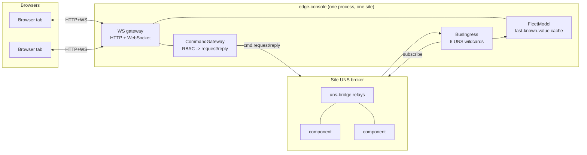
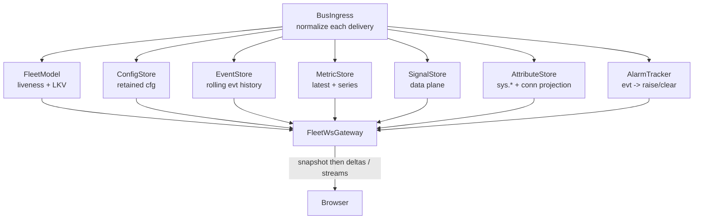

# Explanation — How the Edge Console works, and why

This page is the mental model. For exact options see [reference/](reference/); for tasks, the
[how-to guides](how-to-guides.md).

## The one architectural fact: the console is the *sole* browser↔bus bridge

Browsers cannot — and must not — speak to the message bus. Components are not individually reachable
(on Greengrass they sit behind device-local IPC; even on MQTT you do not want every browser tab holding
bus connections and consuming the shared-connection quota). So the console is the **single** point where
the two worlds meet:



Everything a browser sees or does goes through this one process. That is what makes the console's
security posture, its single connection, and its in-memory model the whole story.

## One bus: the site broker

The console attaches to **exactly one** bus — the *site aggregation point*, the broker every device's
`uns-bridge` relays its device-local traffic into. It never fans out to per-device connections. On a
single-device deployment that broker is the device's own local bus; on Kubernetes it is the in-cluster
broker. The console needs no list of devices or components up front: it discovers the entire fleet by
**subscription**.

## The Unified Namespace, and six wildcards for the whole fleet

Every edgecommons topic is `ecv1/{device}/{component}/{instance}/{class}[/channel]`. The console consumes
the **six consumer classes** with one wildcard each — the entire subscription surface, built through the
library's `uns().filter()` (never a hand-assembled string):

```text
ecv1/+/+/+/state    ecv1/+/+/+/cfg      ecv1/+/+/+/evt/#
ecv1/+/+/+/metric/# ecv1/+/+/+/data/#   ecv1/+/+/+/log/#
```

**Identity always comes from the envelope's top-level `identity` element**, never the topic — the device
is the last hierarchy level, and grouping/routing never parse the body or the topic string. There is
exactly **one documented exception**: the `uns-bridge`'s Last Will is a *bare, un-enveloped* JSON payload
`{"status":"UNREACHABLE"}` that the broker (not the bridge) publishes on
`ecv1/{device}/uns-bridge/{instance}/state`. For that one shape the topic is parsed for `{device}` and
the whole device is marked UNREACHABLE. Every other raw message is dropped.

## The retain substitute: a timestamped last-known-value cache

The platform deliberately uses **no broker retain**. Instead the **FleetModel** is a pure, in-memory
**last-known-value (LKV) cache**, keyed by `(device, component, instance, class[, channel])`, where every
entry carries its **receipt timestamp**. This is the crux of the design: a late-joining browser gets every
current value *immediately* **and** its age — the two things retain would have given, without retain's
cross-broker fragility. The model has an injected clock and does no IO, so the entire liveness engine is
unit-tested with no sleeps and no broker.

## Console-side miss-detection

No component reports "I am late." Liveness is therefore **computed by the console** from the `state`
keepalive backbone. It lives in the console because a consumer is the only party that can notice silence.

- **Cadence is derived, not assumed.** The expected keepalive interval comes from each component's own
  `cfg` announcement (`config.heartbeat.intervalSecs`), defaulting to 5 s until that `cfg` arrives.
- **The ladder**, recomputed by a 1 s sweeper over the age of the last `state`:

  | State | Condition |
  |-------|-----------|
  | **FRESH** | last `state` within `warnMultiplier` × interval (default 2×) |
  | **WARN** | overdue past 2× (the "warn shading" band) |
  | **STALE** | overdue past `staleMultiplier` (2.5×) |
  | **OFFLINE** | overdue past `offlineMultiplier` (5×) — miss-detection's "missing" |
  | **STOPPED** | the component reported a graceful `{"status":"STOPPED"}` — held, no staleness decay, until the next RUNNING state |
  | **UNREACHABLE** | whole-device containment from the bridge LWT (below) |

- **Restart vs gap.** A decrease in the reported `uptimeSecs` means the component restarted (the restart
  counter ticks) — distinct from a silence gap.
- **STOPPED is an explicit truth**, not staleness — so it doesn't decay. It holds until a RUNNING state
  returns.
- **Whole-device UNREACHABLE.** When the bridge dies, the broker publishes its LWT and the console freezes
  that device's subtree: every component under it reports UNREACHABLE **by containment** ("the road is
  down, not the houses" — you get one containment note, not N offline alarms). It is terminal until the
  next `state` **envelope** arrives from that device — a state that reached the site broker *proves the
  uplink relays again*.

## Two planes, two seams

The console keeps a hard line between "who's alive" and "what's the value":

- **The liveness stream carries no bodies.** A `value-updated` delta is a *change notification*, not the
  value. This keeps the fanout cheap and the model authoritative — value bodies live in the LKV cache and
  the side stores.
- **Bodies travel over dedicated, versioned message families** on the *same one* WebSocket connection,
  each backed by a pure side store the ingress tees into: config review (`cfg`), events (`evt`), metrics
  (`metric`), signals (`data`), and the runtime-attributes projection. A screen requests/subscribes what
  it needs; the store answers a snapshot then streams arrivals.



## Snapshot-then-deltas, resume, and backpressure isolation

The gateway is a pure fanout core (the real sockets are a thin IO edge). Its contract:

- On connect, a client's **first frame must be `hello`** carrying the protocol version. The gateway
  replies with **one snapshot** (the current fleet, stamped with its last folded `seq`), then streams
  every subsequent **delta** batch in strictly increasing `seq`.
- **Resume**: a reconnecting client offers `resumeSeq` (the last `seq` it applied). If a bounded
  recent-delta ring can prove contiguous coverage from there, the gateway sends only the missed deltas —
  no snapshot. On any gap it falls back to a fresh snapshot: *correctness over cleverness*.
- **Backpressure is isolated per client.** A client whose transport stays backpressured across several
  delta pushes is dropped-and-resnapshotted rather than queued — it can never stall delivery to any other
  client.
- **Versioned wire.** Every frame carries the protocol version; a stale browser tab against a redeployed
  gateway gets a clean "reload the page", never a silent misparse. The version handshake is why the whole
  UI heals itself on reconnect — a fresh snapshot/backlog replaces whatever the client held.

## Commanding: the write path

The console's write surface is `invoke-command`. The flow is deliberately narrow:

1. the browser asks the gateway to invoke a **verb** (with optional args) on a target component;
2. the gateway **RBAC-checks** it — a denied verb returns `FORBIDDEN` and **never touches the bus**;
3. it builds the target's own `cmd` inbox topic via `uns().topicFor()` and issues **one**
   `messaging.request()` on the site bus (`header.name` = the verb, body = the args);
4. the `uns-bridge` rewrites `reply_to` transparently, so a site→device request/reply just works;
5. the reply maps to a single `command-result` — success, the component's own coded error passed through
   verbatim, or a console-synthesized code (`TIMEOUT`/`REQUEST_FAILED`/`INVALID_TARGET`/`MALFORMED_REPLY`).

Every per-verb deadline is clamped to the `uns-bridge` reply-map TTL (the paired-knob rule — a deadline
that outlived the reply path would leak). The three universal built-ins — `ping`, `reload-config`,
`get-configuration` — are offered on every component; the console does not discover a component's *custom*
verbs.

## The UI: dynamic and hierarchy-driven

The IBM Carbon / React front end renders **whatever the deployment declares** — it never hardcodes a
tier. The fleet table and the Components tree are grouped dynamically from each component's identity
`hier`, so a two-level `site→device` fleet and a five-level `enterprise→site→area→line→device` fleet both
render correctly with no code change. The topology graph derives its nodes from identity and its edges
from each component's `cfg`.

A discipline runs through every screen: **surface what is not derivable rather than fake it.** The
topology's component-to-component dataflow edges are not drawn (there is no flow metadata on the wire); a
component's custom command surface, the Component-Detail *Panel*/*Logs* tabs, and per-signal engineering
units/limits are not populated (they require a `describe` capability the console does not consume). The UI
marks these as unavailable rather than inventing values.

> **On the missing Metrics screen.** There is no standalone Metrics page. The UNS `metric` class is
> consumed and streamable over the WebSocket, and the UI surfaces metrics *in context* — the Overview CPU
> sparkline and connection-state columns (a projection over the metric class) and the Signals trends —
> rather than as its own page.

## A note on security

Two current boundaries:

- **Transport is plain HTTP + WebSocket.** There is no built-in TLS listener. Serve browsers over
  HTTPS/WSS by **terminating TLS in front** (reverse proxy / load balancer / Ingress). The UI derives
  `wss://…/ws` from an `https://` page origin automatically, so no UI change is needed once TLS terminates
  ahead of the console.
- **Connections are not authenticated.** RBAC *enforcement* on the command path is real (a config-driven
  allow/deny per verb, fail-closed), but the console does not resolve the identity of a connection: every
  connection is assigned the configured `defaultRole`. And the *read* surface (snapshot + streams) is
  unauthenticated. **Keep the console on a trusted network.**

These boundaries are surfaced in the product (the Settings screen, the server startup log) as well as
here.

## Deployment shape

Because the console is a standard edgecommons component it deploys the same three ways as everything else —
HOST, Greengrass, Kubernetes — and the library owns config/messaging/logging/metrics/heartbeat/shutdown.
Two console-specific constraints follow from its nature:

- **One replica per site broker.** It holds long-lived WebSockets and an in-memory model; it is not
  horizontally scalable.
- **Browser reachability is the console's own concern, not the bus's** — a bound port on HOST/Greengrass,
  a Service + Ingress on Kubernetes (no packaged chart is included). The `webRoot` option lets one process
  serve both the WebSocket and the built UI, so a self-contained deployment needs no separate front.
