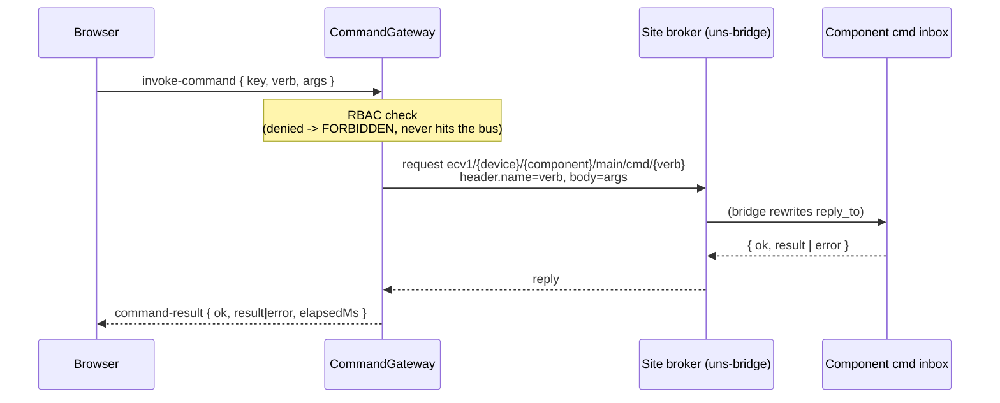

# Reference — Messaging Interface (console ↔ bus)

Everything the console **subscribes**, **publishes**, and **requests** on the site UNS bus. Addressing
follows the **Unified Namespace (UNS)**: `ecv1/{device}/{component}/{instance}/{class}[/channel]`, built
and validated by the library (`@edgecommons/edgecommons`) — never a hand-assembled string. For the
browser↔console WebSocket side, see [data-types.md](data-types.md); for the model, see
[explanation.md](../explanation.md).

- `{device}` — the resolved Thing name (the last `hierarchy` level of the *publishing* component).
- `{component}` — the publisher's component short name.
- `{instance}` — a per-connection instance for `data`/`evt`; `main` for `state`/`cfg`/`metric` and the
  `cmd` inbox.

## What the console consumes: six class wildcards

The console has **one** connection — the site broker — and subscribes the **six consumer-class
wildcards**, built via `uns().filter(cls, UnsScope.all())`. This is its entire read surface; it needs no
per-component topic templates.

| Class | Wildcard | What the console does with it |
|-------|----------|-------------------------------|
| `state` | `ecv1/+/+/+/state` | Liveness backbone (miss-detection); `status`/`uptimeSecs`/`instances[]`; the **only** signal that clears a device's UNREACHABLE. Also delivers the bridge protobuf LWT (below). |
| `cfg` | `ecv1/+/+/+/cfg` | Effective, source-redacted config → the Configuration screen; the cadence source (`config.heartbeat.intervalSecs`). |
| `evt` | `ecv1/+/+/+/evt/#` | Rolling event history + the console-side alarm tracker (raise/clear). |
| `metric` | `ecv1/+/+/+/metric/#` | Metric latest/series + the runtime-attributes projection (`sys.*`, `southbound_health`). |
| `data` | `ecv1/+/+/+/data/#` | The data plane → the Signals screen (latest value + quality + trend). |
| `log` | `ecv1/+/+/+/log/#` | Component log tails. The gateway normalizes `edgecommons.log.v1` records into the Components-page Logs tab. |

`cmd` is **published, never subscribed**, and `app` is not consumed.

The Logs tab requires components to publish the core log bus (`logging.publish.enabled: true`). If a
component only writes local stdout/files and never emits `log/{level}` records, the console has no log
records to display for it.

## Envelope & identity

Normal messages use the EdgeCommons protobuf envelope whose diagnostic JSON shape is
`{header, identity, tags, body}`. The console attributes **every** message by its top-level
**`identity`** element — never the topic:

```jsonc
"identity": {
  "hier": [ { "level": "site", "value": "dallas" }, { "level": "device", "value": "gw-01" } ],
  "path": "dallas/gw-01", "component": "ModbusAdapter", "instance": "plc1"
}
```

- The **device** is the last `hier` value (computed, not a wire field).
- The **class** and **channel** are structural topic positions (the class token's index is known from the
  subscribed filter; the channel is every token after it) — position, not identity.
- `tags` is verbatim business metadata; `_`-prefixed keys (e.g. the bridge hop tag `_relay`) are
  system-reserved and ignored for grouping/business logic.
- `header.timestamp`, when present, is kept as `sourceTimestamp` (display only — it **never** drives
  staleness; the console's own receipt time does). On the `data` class it is additionally surfaced
  verbatim as `publishedTs` on signal series and update entries, so a client can compute publish
  lag against the sample timestamps in the adapter's own clock domain.

An envelope the console cannot attribute (no parseable `identity`) is counted (`missing-identity`) and
dropped — never fatal.

## Bridge Last Will

The `uns-bridge` Last Will is published by the **broker** when the bridge connection dies, but the payload
is still a normal EdgeCommons protobuf `state` envelope from the bridge identity:

```text
topic:   ecv1/{device}/uns-bridge/{instance}/state
body:    {"status":"UNREACHABLE"}
```

For this bridge `state` envelope, `status === "UNREACHABLE"` marks the **whole device** UNREACHABLE with
event time equal to console receipt time. Every raw/non-protobuf message is dropped before the ingress
folds it into the model.

## What the console publishes

### As a component (library-owned)

The console is itself `com.mbreissi.edgecommons.EdgeConsole`, so the library publishes its **own** `state`
keepalive, `metric` health, and `cfg` on `main` — visible to *another* console. These are the standard
reserved classes; the console never hand-addresses them.

### The per-device republish broadcast (late-join rehydration)

The console publishes fire-and-forget `cmd` broadcasts to the reserved `_bcast` pseudo-component, asking
already-running components on a device to re-announce (the platform uses no broker retain):

```text
ecv1/{device}/_bcast/main/cmd/republish-state
ecv1/{device}/_bcast/main/cmd/republish-cfg
```

- **Discovery** — on first sight of a device (and for already-known devices at startup) the console fires
  **both** verbs, rehydrating that device's `state` and `cfg` at once.
- **Configuration Refresh** — the browser's `refresh-config` action fires **only** `republish-cfg`. A
  config refresh re-pulls configuration without touching liveness observation: it never re-triggers the
  `state` keepalive, so it cannot reset any component's staleness clock.

They are answered only if the device-side edgecommons runtime handles the `_bcast` broadcast; the periodic
`state` keepalive reconverges liveness within one interval regardless, while the `cfg` of a long-running
component may not refresh until it re-announces. No `reply_to`, no direct reply; a hostile/invalid device
token or a publish failure is logged and skipped.

### The self-reported clock fault (`evt/warning/clock-step`)

When the gateway observes its own wall clock stepping backward past
`console.clock.stepAlarmThresholdMs` (see [configuration.md](configuration.md)), it publishes a
canonical event on its **own** UNS identity:

```text
ecv1/{own-device}/{console-component}/main/evt/warning/clock-step
body: { "message": "gateway wall clock stepped backward <n> ms; receipt timeline clamped (see console.clock)",
        "stepMs": <n>, "active": true }
```

The envelope is indistinguishable from any component's event, so it round-trips through the
console's own `evt` subscription and raises the `clock-step` alarm through the normal
event/alarm pipeline — one observation per backward window. After
`console.clock.clearAfterQuietSecs` without a step, the console publishes the same channel with
`"active": false`, clearing the alarm into history. Publishing is fire-and-forget; a failure is
logged and never blocks ingestion.

## The command write path

Commanding is the console's only write surface onto components. The browser's `invoke-command`
([data-types.md](data-types.md#commands)) becomes a request/reply on the site bus:



- **Topic**: `ecv1/{device}/{component}/main/cmd/{verb}`, built with `uns().topicFor(target, Cmd, verb)`.
  The inbox is the component's `main` instance (verbs register there; per-instance dispatch is by a body
  selector, not the topic).
- **Request**: `header.name` **must equal** the verb; the body is the `args` object (`{}` when omitted).
- **`reply_to`** is rewritten transparently by the `uns-bridge`, so a site→device request/reply just
  works on the console's single connection.
- **Deadline**: the per-verb timeout (`console.commands`), clamped to `[1, maxTimeoutMs]` where
  `maxTimeoutMs` (60 s) is the bridge reply-map TTL.

### Reply contract

A component answers `{"ok": true, "result": <object>}` or
`{"ok": false, "error": {"code", "message"}}`. The component's own error codes pass through verbatim; the
gateway adds console-side codes (`FORBIDDEN`/`TIMEOUT`/`REQUEST_FAILED`/`INVALID_TARGET`/`MALFORMED_REPLY`,
plus `UNAVAILABLE` when no command seam is wired). See
[data-types.md → Commands](data-types.md#commands).

### Built-in verbs

Every edgecommons component answers three universal built-ins, which the console offers on all components:

| Verb | Result (typical) |
|------|------------------|
| `ping` | `{ status, uptimeSecs }` |
| `get-configuration` | the component's effective configuration |
| `reload-config` | `{ reloaded: true }` (or a `RELOAD_FAILED`/`NO_CONFIG` error) |

A component's **custom** verbs cannot be enumerated (the console does not consume a `describe` manifest),
so the UI offers the built-ins plus a generic *verb + args* form.

## Reserved classes

`state`/`cfg`/`metric`/`log` are library-owned **reserved** classes — a normal component publish to them
is rejected. The console only ever *reads* them, and only ever *mints* the `_bcast … /cmd/republish-*`
broadcasts and the per-component `…/cmd/{verb}` command requests, always through the library's
`uns()`/`messaging()` facades — never a hand-assembled topic string.

## Subscription mechanics

| Property | Value |
|----------|-------|
| Filters | the six `uns().filter(cls, UnsScope.all())` wildcards |
| Dispatch | serial per class (`concurrency = 1`) — ordered folds into the model |
| Per-subscription queue bound | 256 messages |
| Shutdown | every filter is unsubscribed (idempotent) — the bus is always left clean |

`subscribedFilters()` exposes the active filters for diagnostics; the startup log prints them
(`edge-console ingress subscribed: …`).

## Security posture

The browser↔console surface is a **trusted-network** posture: the read surface is unauthenticated
and every connection resolves to `console.rbac.defaultRole`. Two edge protections apply:

- **Origin-gated WebSocket.** The `/ws` upgrade is rejected (`403`, before the handshake) unless the
  request is same-origin, carries no `Origin` (a non-browser client), or its `Origin` is listed in
  `console.ws.allowedOrigins` — a CSWSH defense so a cross-site page in an operator's browser cannot
  open the socket. Static assets and `/healthz` are ordinary same-origin-policy resources and stay
  open.
- **Loopback by default.** `console.ws.bindAddress` defaults to `127.0.0.1`; wider binding is an
  explicit opt-in (containers set `0.0.0.0`).

Role resolution runs at upgrade time through a pluggable resolver that maps request headers to a
console role. The default resolver returns `defaultRole` for everyone; **this resolver is where
production authentication attaches** (bearer / client-certificate / OIDC → console role) without
changing the session loop. The console does not authenticate the read surface or resolve a connecting
principal; every connection resolves to `console.rbac.defaultRole`.
